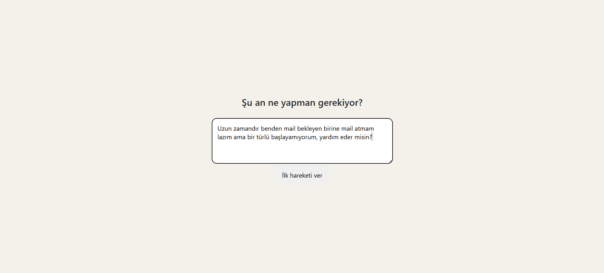
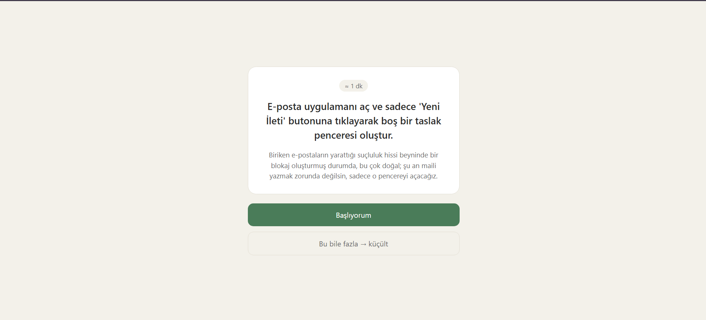
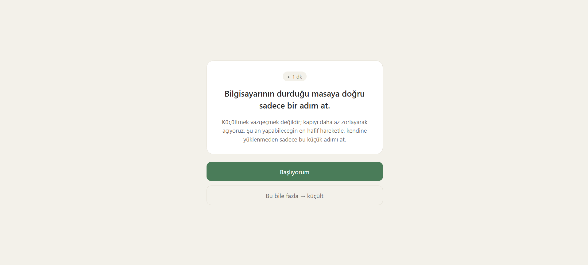
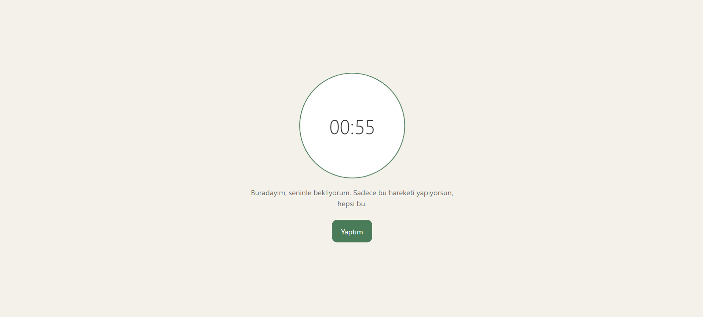
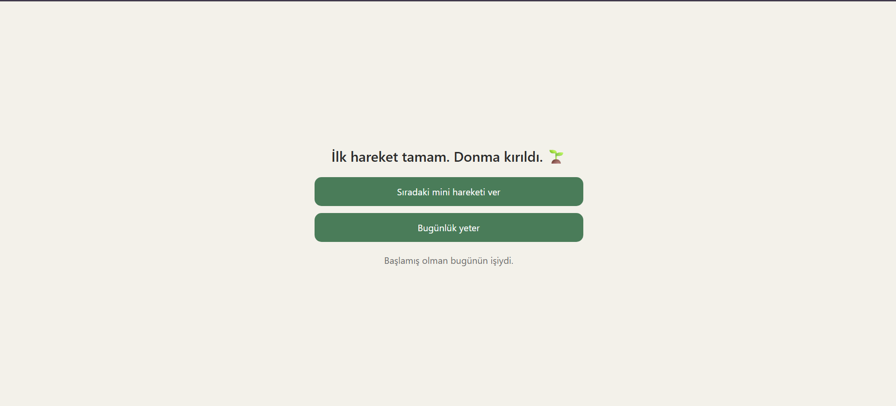

# 🚀 TaskBreak AI — Görevi Değil, Donmayı Kırar

> ADHD'li yetişkinler için yargısız bir **görev başlatma (task initiation)** aracı.

### 👥 Takım Bilgileri
* **Takım İsmi:** MicroMinds
* **Takım Elemanları ve Rolleri:**
  * Saltuk Buğra Han Yıldız: Scrum Master
  * Aysu Keskin: Product Owner
  * Yeliz Kurt : Developer
  * Ceren Şahin: Developer
  * Mustafa Çalışkan: Developer

---

### 💡 Ürün İle İlgili Bilgiler

#### 📦 Ürün İsmi
**TaskBreak AI** — isimdeki *break*, görevi parçalamayı değil, **başlayamama anını kırmayı** ifade eder.

#### 🔍 Ürün Açıklaması
TaskBreak AI bir yapılacaklar listesi ya da görev bölücü değildir. ADHD'li yetişkinlerin bir göreve **başlayamadığı o donma (task paralysis) anını** çözen, yargısız bir görev başlatma aracıdır.

Kullanıcı *"şunu yapmam lazım ama başlayamıyorum"* dediğinde ürün ona plan ya da 10 maddelik liste sunmaz; yalnızca **sonraki gülünç derecede küçük, 1-2 dakikalık ilk hareketi** verir ve görünür bir geri sayım + body doubling (birlikte çalışma) hissiyle o hareketi başlatmasına eşlik eder.

> **Konum:** *Todoist ne yapman gerektiğini söyler. TaskBreak AI, listeye bakamadığın anda devreye girer.*

TaskBreak AI bir tedavi veya klinik araç değildir; günlük görev başlatmayı kolaylaştıran bir yardımcıdır.

---

### 📈 Sprint Günlükleri ve Kanıtlar

<h4>🏃‍♂️ Sprint 1 (19 Haziran – 5 Temmuz 2026)</h4>

#### Sprint Notları
Sprint 1'in hedefi **Keşif ve Ürün Tanımı** olarak belirlendi: problem alanının araştırılması, fikrin netleştirilip akademiye bildirilmesi, ürün tanımının belgelenmesi, backlog'un oluşturulması, teknoloji seçimi ve ilk arayüz prototipi.

#### Tahmin Edilen Tamamlanacak Puan ve Mantığı
* **Sprint 1 hedefi:** 100 puan — **Tamamlanan:** 100 puan ✅
* **Backlog dağıtma mantığı:** Proje boyunca tamamlanması gereken toplam **300 puanlık** backlog bulunmaktadır. Bu yük 3 sprint'e eşit ağırlıkta (100+100+100) dağıtılmıştır: Sprint 1 keşif ve ürün tanımına, Sprint 2 çalışan MVP'nin (iki AI ajanı + donma anı akışı) geliştirilmesine, Sprint 3 kişiselleştirme, yayına alma ve teslime ayrılmıştır. Puanlama **Fibonacci dizisi** ile yapılmıştır; iş kalemleri ve puanları [Product Backlog](docs/ProductBacklog.md) dosyasındadır.

#### Daily Scrum
Daily Scrum notları yazılı çalışma günlüğü formatında tutulmuştur: 📄 [docs/sprint1/daily_scrum.md](docs/sprint1/daily_scrum.md)

#### Sprint Board
Sprint 1 board'u, backlog dosyası üzerindeki durum kolonlarıyla takip edilmiştir (✅ Tamamlandı / 🔜 Planlandı): [docs/ProductBacklog.md](docs/ProductBacklog.md)

#### Ürün Durumu
Sprint 1 sonunda ürünün **donma anı akışını** gösteren ilk arayüz prototipi hazırlanmıştır: görev girişi, tek mikro hareket kartı ("Başlıyorum" / "Bu bile fazla"), body doubling'li geri sayım ekranı ve kapanış ([prototype/index.html](prototype/index.html)).

#### Sprint Review
* Proje fikri süresi içinde (21 Haziran) akademiyle paylaşıldı; ürün tanımı 26 Haziran'da README ile yayınlandı.
* Sprint kapanışında ürün konumu gözden geçirildi ve **daraltıldı**: genel bir "AI görev bölücü" yerine, ADHD'li yetişkinlerin görev başlatma güçlüğüne odaklanan yargısız bir başlatma aracı. Gerekçe: bölünmüş görev listeleri "başlayamama" sorununu çözmüyor; net bir kitle ve net bir an (donma anı) seçmek ihtiyaç-çözüm eşleşmesini ve pazar konumunu güçlendiriyor. Bu doğrultuda ilk B2B kurumsal çerçeve, "gelecek vizyonu" olarak stratejiye taşındı.
* Ürün stratejisi belgelendi: konumlandırma, 30 saniyelik çekirdek deneyim, MVP kapsamı (ve bilinçli olarak kapsam dışı bırakılanlar), gelir modeli, en büyük risk ve önlemleri.
* 300 puanlık Product Backlog oluşturuldu ve sprint'lere dağıtıldı; teknoloji seçimi tamamlandı (Python + Streamlit + LLM API + JSON/SQLite hafıza).
* Donma anı akışını gösteren çalışan arayüz prototipi (mock) hazırlandı.

#### Sprint Retrospective
* **İyi gidenler:** Fikir süresi içinde bildirildi; sprint kapanışında yapılan konum netleştirmesi ürünü belirgin şekilde güçlendirdi.
* **Zorluklar:** Dokümantasyon ve planlama işlerinin büyük kısmı sprint'in son gününe yığıldı; ekip içi koordinasyon ve zaman yönetimi bu sprint'te beklenenden zorlayıcı oldu.
* **Alınan kararlar:** (1) Sprint 2'de işler haftalık mini hedeflere bölünecek ve her çalışma günü commit + daily scrum notu atılacak — son güne yığılma tekrarlanmayacak. (2) MVP kapsamı iki çekirdek ajan + donma anı akışıyla sınırlı tutulacak; cazip ama erken özellikler (entegrasyonlar, oyunlaştırma) bilinçli olarak dışarıda bırakılacak. (3) Her hafta sonunda ara değerlendirme yapılarak kapsam gerekirse daraltılacak.

<h4>🏃‍♂️ Sprint 2 (6 Temmuz – 19 Temmuz 2026)</h4>

#### Sprint Notları
Sprint 2'nin hedefi **Çalışan MVP** olarak belirlendi: iki AI ajanı (İlk Hareket Üretici + Ton Bekçisi) ve donma anı akışının uçtan uca çalışır hale getirilmesi. Sprint başında ayrıntılı bir görev planı hazırlanıp ekiple paylaşıldı ([docs/sprint2/Sprint2_Gorev_Plani.md](docs/sprint2/Sprint2_Gorev_Plani.md)); görev dağılımı Aysu 47 / Yeliz 26 / Buğra 27 puan olarak planlandı.

**Sprintin çekirdek hedefi tamamlandı:** görev girişinden alt hareket üretimine, küçültmeye, sayaç ve kapanışa kadar tüm akış gerçek yapay zekâ ile çalışır durumda. Ancak ekip üyelerinden plana dönüş ve katkı gelmediği için yük Product Owner'da kaldı; arayüz cilası, test setinin genişletilmesi ve bazı süreç çıktıları eksik kaldı.

#### Tamamlanan Puan ve Mantığı
* **Sprint 2 hedefi:** 100 puan — **Tamamlanan (çalışan MVP çekirdeği):** ~60 puan
* **Tamamlananlar:** İlk Hareket Üretici Agent (21), Ton Bekçisi Agent (13), "Bu bile fazla" küçültme (13) — PO'nun 47 puanlık işleri; ek olarak donma anı akışının çalışan 4 ekranı, temel hafıza ve yargısız hata yedekleri çalışır halde kuruldu.
* **Sprint 3'e taşınanlar:** Arayüz cilası, 50 görevlik test setinin tamamlanması (şu an 10/50), sprint board ve düzenli daily scrum gibi süreç çıktıları. Gerekçe: ekip katılımı sağlanamadı; bu, retrospektifte açıkça ele alındı.

#### Daily Scrum
Sprint 2 daily scrum notları (gerçek seyriyle): 📄 [docs/sprint2/daily_scrum.md](docs/sprint2/daily_scrum.md)

#### Ürün Durumu
Donma anı akışı uçtan uca çalışır durumdadır: görev girişi → tek mikro hareket kartı ("Başlıyorum" / "Bu bile fazla") → body doubling'li geri sayım → yargısız kapanış. Backend gerçek Gemini API'siyle tek hareket üretir, Ton Bekçisi yargı dilini engeller, oturumlar hafızaya kaydedilir.

**Giriş — tek soru, tek kutu:**

**İlk Hareket Kartı — tek mikro hareket + yargısız bağlam + iki düğme:**

**"Bu bile fazla" — daha küçük, daha fiziksel bir hareket:**

**Sayaç + body doubling — sakin geri sayım ve eşlik:**

**Kapanış — abartısız kutlama, zorlamasız seçenekler:**

#### Teknoloji Notu
Backend başta FastAPI + uvicorn planlandı; ancak geliştirme makinesindeki Python 3.13.13 bu yığınla native çökme (access violation) verdiği için backend, hiçbir dış paket gerektirmeyen Python standart kütüphanesi `http.server` + Gemini REST mimarisine taşındı. **API sözleşmesi (uçlar + JSON) değişmedi**, frontend etkilenmedi. Ayrıntı: [Sprint2 planı §3](docs/sprint2/Sprint2_Gorev_Plani.md).

#### Sprint Review
* Sprint hedefinin çekirdeği (çalışan MVP) karşılandı ve demo edilebilir durumda: iki ajanlı orkestrasyon, donma anı akışının dört ekranı, küçültme, hafıza ve yargısız hata yedekleri.
* Karşılaşılan teknik engel (Python 3.13.13 / FastAPI-uvicorn native uyumsuzluğu) çözüldü; backend stdlib tabanlı bir mimariye taşınarak her makinede çalışır hale getirildi.
* Kod, dokümantasyon ve kurulum dosyaları GitHub'a yüklendi.
* Planlanan görev dağılımının bir kısmı (arayüz cilası, test seti genişletme, süreç çıktıları) ekip katılımı sağlanamadığı için Sprint 3'e taşındı.

#### Sprint Retrospective
* **İyi gidenler:** Sprintin en zor kısmı — çalışan, demo edilebilir bir MVP çekirdeği — ortaya çıktı. Beklenmeyen bir teknik engel sprint içinde çözüldü.
* **Zorluklar:** Ekip koordinasyonu sağlanamadı. Görev planı paylaşıldı ancak ekip üyelerinden dönüş/commit gelmedi; iş yükü tek kişide kaldı ve planlanan işlerin bir kısmı yetişmedi.
* **Alınan kararlar (Sprint 3):** (1) Görev dağılımı ve beklentiler ekiple yeniden, net şekilde konuşulacak; küçük ve takip edilebilir hedeflere bölünecek. (2) Düzenli (kısa ve yazılı) check-in'ler konarak ilerleme görünür kılınacak. (3) Ekip katılımı yine sağlanamazsa kapsam, tek kişinin gerçekçi biçimde bitirebileceği bir MVP'ye daraltılacak — böylece teslim riske girmeyecek.

<h4>🏃‍♂️ Sprint 3 (20 Temmuz – 2 Ağustos 2026)</h4>

*Sprint 3 sonunda doldurulacaktır.*

