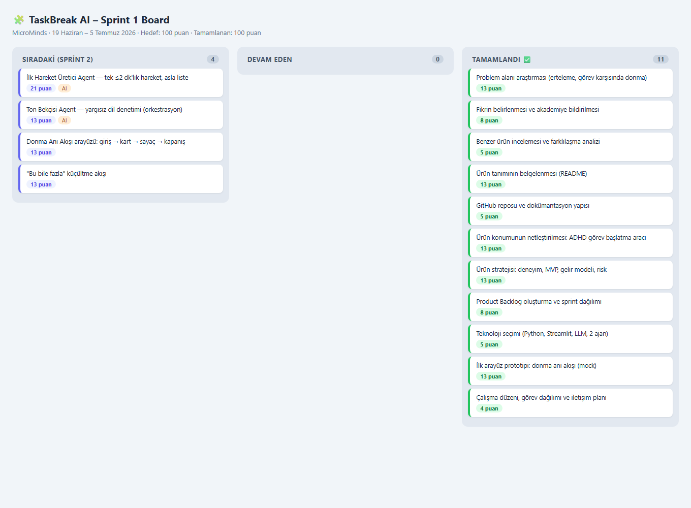
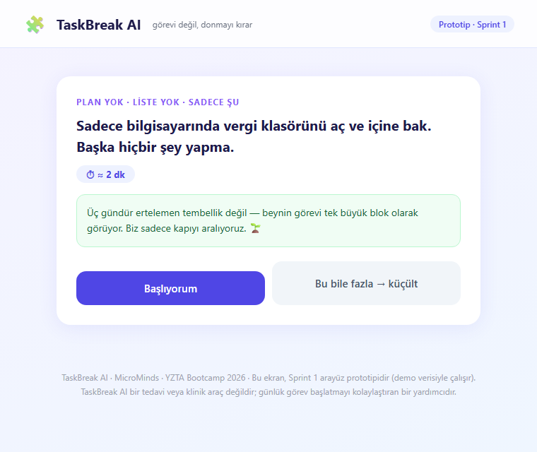
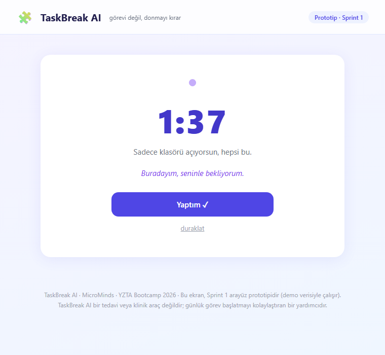

# 🚀 TaskBreak AI — Görevi Değil, Donmayı Kırar

> ADHD'li yetişkinler için yargısız bir **görev başlatma (task initiation)** aracı.

### 👥 Takım Bilgileri
* **Takım İsmi:** MicroMinds
* **Takım Elemanları ve Rolleri:**
  * Saltuk Buğra Han Yıldız: Scrum Master
  * Aysu Keskin: Product Owner
  * Yeliz Kurt : Developer
  * Ceren Şahin: Developer
  * Mustafa Çalışkan: Developer

---

### 💡 Ürün İle İlgili Bilgiler

#### 📦 Ürün İsmi
**TaskBreak AI** — isimdeki *break*, görevi parçalamayı değil, **başlayamama anını kırmayı** ifade eder.

#### 🔍 Ürün Açıklaması
TaskBreak AI bir yapılacaklar listesi ya da görev bölücü değildir. ADHD'li yetişkinlerin bir göreve **başlayamadığı o donma (task paralysis) anını** çözen, yargısız bir görev başlatma aracıdır.

Kullanıcı *"şunu yapmam lazım ama başlayamıyorum"* dediğinde ürün ona plan ya da 10 maddelik liste sunmaz; yalnızca **sonraki gülünç derecede küçük, 1-2 dakikalık ilk hareketi** verir ve görünür bir geri sayım + body doubling (birlikte çalışma) hissiyle o hareketi başlatmasına eşlik eder.

> **Konum:** *Todoist ne yapman gerektiğini söyler. TaskBreak AI, listeye bakamadığın anda devreye girer.*

TaskBreak AI bir tedavi veya klinik araç değildir; günlük görev başlatmayı kolaylaştıran bir yardımcıdır.

---

### 📈 Sprint Günlükleri ve Kanıtlar

<h4>🏃‍♂️ Sprint 1 (19 Haziran – 5 Temmuz 2026)</h4>

#### Sprint Notları
Sprint 1'in hedefi **Keşif ve Ürün Tanımı** olarak belirlendi: problem alanının araştırılması, fikrin netleştirilip akademiye bildirilmesi, ürün tanımının belgelenmesi, backlog'un oluşturulması, teknoloji seçimi ve ilk arayüz prototipi.

#### Tahmin Edilen Tamamlanacak Puan ve Mantığı
* **Sprint 1 hedefi:** 100 puan — **Tamamlanan:** 100 puan ✅
* **Backlog dağıtma mantığı:** Proje boyunca tamamlanması gereken toplam **300 puanlık** backlog bulunmaktadır. Bu yük 3 sprint'e eşit ağırlıkta (100+100+100) dağıtılmıştır: Sprint 1 keşif ve ürün tanımına, Sprint 2 çalışan MVP'nin (iki AI ajanı + donma anı akışı) geliştirilmesine, Sprint 3 kişiselleştirme, yayına alma ve teslime ayrılmıştır. Puanlama **Fibonacci dizisi** ile yapılmıştır; iş kalemleri ve puanları [Product Backlog](docs/ProductBacklog.md) dosyasındadır.

#### Daily Scrum
Daily Scrum notları yazılı çalışma günlüğü formatında tutulmuştur: 📄 [docs/sprint1/daily_scrum.md](docs/sprint1/daily_scrum.md)

#### Sprint Board
Sprint 1 board'u, backlog dosyası üzerindeki durum kolonlarıyla takip edilmiştir (✅ Tamamlandı / 🔜 Planlandı): [docs/ProductBacklog.md](docs/ProductBacklog.md)

#### Ürün Durumu
Sprint 1 sonunda ürünün **donma anı akışını** gösteren ilk arayüz prototipi hazırlanmıştır: görev girişi, tek mikro hareket kartı ("Başlıyorum" / "Bu bile fazla"), body doubling'li geri sayım ekranı ve kapanış ([prototype/index.html](prototype/index.html)).

#### Sprint Review
* Proje fikri süresi içinde (21 Haziran) akademiyle paylaşıldı; ürün tanımı 26 Haziran'da README ile yayınlandı.
* Sprint kapanışında ürün konumu gözden geçirildi ve **daraltıldı**: genel bir "AI görev bölücü" yerine, ADHD'li yetişkinlerin görev başlatma güçlüğüne odaklanan yargısız bir başlatma aracı. Gerekçe: bölünmüş görev listeleri "başlayamama" sorununu çözmüyor; net bir kitle ve net bir an (donma anı) seçmek ihtiyaç-çözüm eşleşmesini ve pazar konumunu güçlendiriyor. Bu doğrultuda ilk B2B kurumsal çerçeve, "gelecek vizyonu" olarak stratejiye taşındı.
* Ürün stratejisi belgelendi: konumlandırma, 30 saniyelik çekirdek deneyim, MVP kapsamı (ve bilinçli olarak kapsam dışı bırakılanlar), gelir modeli, en büyük risk ve önlemleri.
* 300 puanlık Product Backlog oluşturuldu ve sprint'lere dağıtıldı; teknoloji seçimi tamamlandı (Python + Streamlit + LLM API + JSON/SQLite hafıza).
* Donma anı akışını gösteren çalışan arayüz prototipi (mock) hazırlandı.

#### Sprint Retrospective
* **İyi gidenler:** Fikir süresi içinde bildirildi; sprint kapanışında yapılan konum netleştirmesi ürünü belirgin şekilde güçlendirdi.
* **Zorluklar:** Dokümantasyon ve planlama işlerinin büyük kısmı sprint'in son gününe yığıldı; ekip içi koordinasyon ve zaman yönetimi bu sprint'te beklenenden zorlayıcı oldu.
* **Alınan kararlar:** (1) Sprint 2'de işler haftalık mini hedeflere bölünecek ve her çalışma günü commit + daily scrum notu atılacak — son güne yığılma tekrarlanmayacak. (2) MVP kapsamı iki çekirdek ajan + donma anı akışıyla sınırlı tutulacak; cazip ama erken özellikler (entegrasyonlar, oyunlaştırma) bilinçli olarak dışarıda bırakılacak. (3) Her hafta sonunda ara değerlendirme yapılarak kapsam gerekirse daraltılacak.

<h4>🏃‍♂️ Sprint 2 (6 Temmuz – 19 Temmuz 2026)</h4>

*Sprint 2 sonunda doldurulacaktır.*

<h4>🏃‍♂️ Sprint 3 (20 Temmuz – 2 Ağustos 2026)</h4>

*Sprint 3 sonunda doldurulacaktır.*

