# 🚀 TaskBreak AI — Görevi Değil, Donmayı Kırar

> ADHD'li yetişkinler için yargısız bir **görev başlatma (task initiation)** aracı.

### 👥 Takım Bilgileri
* **Takım İsmi:** MicroMinds
* **Takım Elemanları ve Rolleri:**
  * Saltuk Buğra Han Yıldız: Scrum Master
  * Aysu Keskin: Product Owner
  * Yeliz Kurt : Developer
  * Ceren Şahin: Developer
  * Mustafa Çalışkan: Developer

---

### 💡 Ürün İle İlgili Bilgiler

#### 📦 Ürün İsmi
**TaskBreak AI** — isimdeki *break*, görevi parçalamayı değil, **başlayamama anını kırmayı** ifade eder.

#### 🔍 Ürün Açıklaması
TaskBreak AI bir yapılacaklar listesi ya da görev bölücü değildir. ADHD'li yetişkinlerin bir göreve **başlayamadığı o donma (task paralysis) anını** çözen, yargısız bir görev başlatma aracıdır.

Kullanıcı *"şunu yapmam lazım ama başlayamıyorum"* dediğinde ürün ona plan ya da 10 maddelik liste sunmaz; yalnızca **sonraki gülünç derecede küçük, 1-2 dakikalık ilk hareketi** verir ve görünür bir geri sayım + body doubling (birlikte çalışma) hissiyle o hareketi başlatmasına eşlik eder.

> **Konum:** *Todoist ne yapman gerektiğini söyler. TaskBreak AI, listeye bakamadığın anda devreye girer.*

TaskBreak AI bir tedavi veya klinik araç değildir; günlük görev başlatmayı kolaylaştıran bir yardımcıdır.

---

### 🏗️ Mimari ve Teknik Kararlar

#### Katmanlar

| Katman | Teknoloji | Sorumluluk |
|---|---|---|
| Arayüz | React (Vite) | 5 ekran; backend'e **yalnızca** `src/api.js` üzerinden çıkar |
| API | Python standart kütüphanesi (`http.server`) | Uçlar, hata yakalama, veri yükleme |
| Ajanlar | Gemini REST (`urllib`) | İlk Hareket Üretici + Ton Bekçisi |
| Kural | `models.py`, `personalization.py` | Çıktı sözleşmesi doğrulaması, kişiselleştirme kademesi |
| Veri | JSON dosyaları | Oturum geçmişi ve kullanıcı profili |

Backend **hiçbir dış paket gerektirmez**; `requirements.txt` boştur.

#### Bir isteğin izlediği yol

```
Kullanıcı → api.js → main.py ─┬─ user_profile.profil_getir()
                              └─ memory.oturumlari_getir()
                                     ↓
              personalization.baslangic_kademesi()   ← kişiselleştirme kademesi (0–3)
                                     ↓
              first_move.ilk_hareket()
                     ├─ Gemini çağrısı (client.py)
                     ├─ models.sozlesme_ihlalleri()  ← uymazsa 3 kez yeniden üret
                     └─ tone_guard.kart_denetle()    ← yargı dili varsa yeniden yazdır
                                     ↓
                          kart  ·  hata olursa fallbacks.yedek_kart()
```

**İki ajanlı orkestrasyon** buradadır: üretici ajanın çıktısı, denetleyici ajandan geçmeden kullanıcıya ulaşamaz. Kirli metin ekrana **teknik olarak** giremez; bu iyi niyete bırakılmamıştır.

**Sorumluluk ayrımı bilinçlidir:** `personalization.py` saf bir modüldür (dosya okumaz, ağa çıkmaz — girdileri parametre alır), veri yükleme `main.py`'nin işidir, ajan dosyaları yalnızca "üret → doğrula → denetle" akışını taşır. Bu sayede kişiselleştirme mantığı gerçek API çağrısı yapmadan test edilebilir.

#### Veri katmanı: neden veritabanı değil

Hafıza iki JSON dosyasında tutulur: `backend/data/sessions.json` (başlatma geçmişi) ve `backend/data/profile.json` (kullanıcı profili). Klasör `.gitignore`'dadır — kullanıcı verisi repoya gönderilmez.

Bu bilinçli bir karardır. Backlog'da hafıza kalemi baştan "JSON/SQLite" olarak esnek tanımlanmıştı. Ürün tek kullanıcılıdır ve az veri üretir; SQLite'ın çözdüğü problemler (eşzamanlılık, sorgulama, ölçek) bu kapsamda mevcut değildir. Önemli olan hafızanın **kullanılıyor** olmasıdır: geçmiş oturumlardaki küçültme davranışı, yeni bir görevde verilecek ilk hareketin boyutunu doğrudan belirler.

**Ne zaman SQLite'a geçilmeli:** çok kullanıcılı kullanıma geçildiğinde, oturum sayısı dosya okumayı yavaşlatacak boyuta ulaştığında ya da tarih/kategori bazlı sorgulama gerektiğinde. Canlıya alma senaryosundaki kalıcılık sınırı [DEPLOY.md](DEPLOY.md) §4'te belgelenmiştir.

#### Teknik kararlar ve gerekçeleri

| Karar | Gerekçe |
|---|---|
| Streamlit → **React + ayrık backend** *(Sprint 2)* | Katmanların ayrılması paralel çalışmayı mümkün kıldı |
| FastAPI/uvicorn → **stdlib `http.server`** *(Sprint 2)* | Geliştirme makinesindeki Python 3.13.13 native çökme veriyordu; API sözleşmesi değişmedi, `pip install` bağımlılığı sıfıra indi |
| SDK yerine **Gemini REST** | Aynı native uyumsuzluk; `urllib` ile dış paketsiz çözüldü |
| Sabit yapılandırma → **ortam değişkenleri** *(Sprint 3)* | Anahtar yalnızca `.env` dosyasından okunuyordu; hiçbir sunucuda çalışamazdı |
| `gemini-flash-latest` → **`gemini-flash-lite-latest`** *(Sprint 3)* | Ücretsiz katmanda günlük 20 istek sınırı ölçüldü; bu limit regresyon testini ve normal kullanımı imkânsız kılıyordu |

#### Hata dayanıklılığı

Kullanıcı **asla** teknik hata veya yargılayıcı dil görmez. API erişilemezse, kota dolarsa veya yanıt bozuksa `fallbacks.py` yargısız bir yedek kart döndürür. Çıktı sözleşmesinden geçemeyen hareket üç kez yeniden üretilir; Ton Bekçisi'nden geçemeyen metin yeniden yazdırılır, olmazsa kart hiç gösterilmez.

---

### 📈 Sprint Günlükleri ve Kanıtlar

<details open>
<summary><h4>🏃‍♂️ Sprint 1 (19 Haziran – 5 Temmuz 2026)</h4></summary>

#### Sprint Notları
Sprint 1'in hedefi **Keşif ve Ürün Tanımı** olarak belirlendi: problem alanının araştırılması, fikrin netleştirilip akademiye bildirilmesi, ürün tanımının belgelenmesi, backlog'un oluşturulması, teknoloji seçimi ve ilk arayüz prototipi.

#### Tahmin Edilen Tamamlanacak Puan ve Mantığı
* **Sprint 1 hedefi:** 100 puan — **Tamamlanan:** 100 puan ✅
* **Backlog dağıtma mantığı:** Proje boyunca tamamlanması gereken toplam **300 puanlık** backlog bulunmaktadır. Bu yük 3 sprint'e eşit ağırlıkta (100+100+100) dağıtılmıştır: Sprint 1 keşif ve ürün tanımına, Sprint 2 çalışan MVP'nin (iki AI ajanı + donma anı akışı) geliştirilmesine, Sprint 3 kişiselleştirme, yayına alma ve teslime ayrılmıştır. Puanlama **Fibonacci dizisi** ile yapılmıştır; iş kalemleri ve puanları [Product Backlog](docs/ProductBacklog.md) dosyasındadır.

#### Daily Scrum
Daily Scrum notları yazılı çalışma günlüğü formatında tutulmuştur: 📄 [docs/sprint1/daily_scrum.md](docs/sprint1/daily_scrum.md)

#### Sprint Board
Sprint 1 board'u, backlog dosyası üzerindeki durum kolonlarıyla takip edilmiştir (✅ Tamamlandı / 🔜 Planlandı): [docs/ProductBacklog.md](docs/ProductBacklog.md)

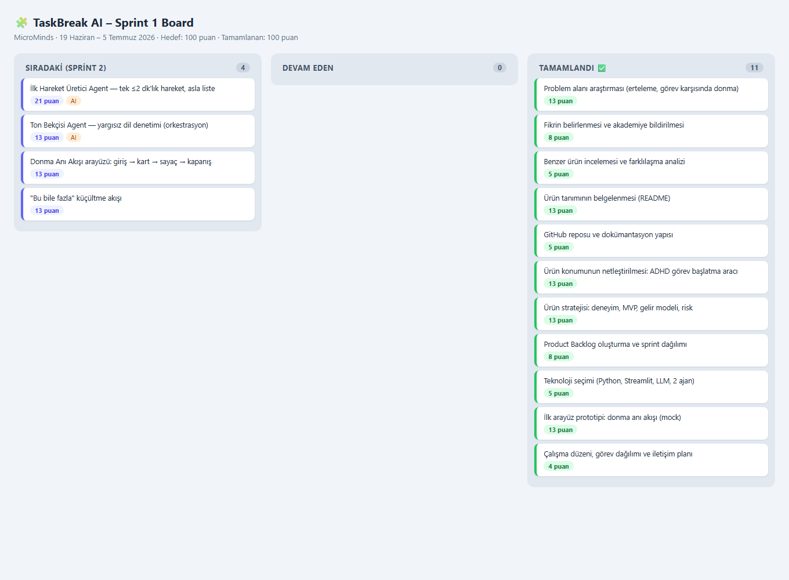

#### Ürün Durumu
Sprint 1 sonunda ürünün **donma anı akışını** gösteren ilk arayüz prototipi hazırlanmıştır: görev girişi, tek mikro hareket kartı ("Başlıyorum" / "Bu bile fazla"), body doubling'li geri sayım ekranı ve kapanış ([prototype/index.html](prototype/index.html)).

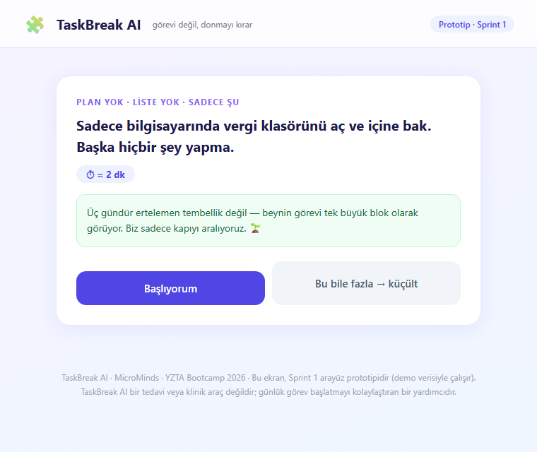
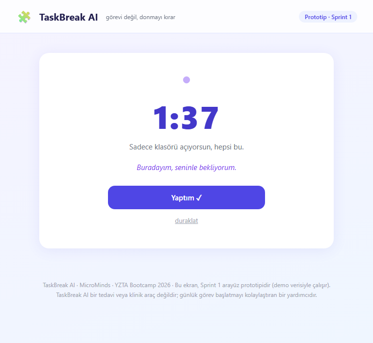

#### Sprint Review
* Proje fikri süresi içinde (21 Haziran) akademiyle paylaşıldı; ürün tanımı 26 Haziran'da README ile yayınlandı.
* Sprint kapanışında ürün konumu gözden geçirildi ve **daraltıldı**: genel bir "AI görev bölücü" yerine, ADHD'li yetişkinlerin görev başlatma güçlüğüne odaklanan yargısız bir başlatma aracı. Gerekçe: bölünmüş görev listeleri "başlayamama" sorununu çözmüyor; net bir kitle ve net bir an (donma anı) seçmek ihtiyaç-çözüm eşleşmesini ve pazar konumunu güçlendiriyor. Bu doğrultuda ilk B2B kurumsal çerçeve, "gelecek vizyonu" olarak stratejiye taşındı.
* Ürün stratejisi belgelendi: konumlandırma, 30 saniyelik çekirdek deneyim, MVP kapsamı (ve bilinçli olarak kapsam dışı bırakılanlar), gelir modeli, en büyük risk ve önlemleri.
* 300 puanlık Product Backlog oluşturuldu ve sprint'lere dağıtıldı; teknoloji seçimi tamamlandı (Python + Streamlit + LLM API + JSON/SQLite hafıza).
* Donma anı akışını gösteren çalışan arayüz prototipi (mock) hazırlandı.

#### Sprint Retrospective
* **İyi gidenler:** Fikir süresi içinde bildirildi; sprint kapanışında yapılan konum netleştirmesi ürünü belirgin şekilde güçlendirdi.
* **Zorluklar:** Dokümantasyon ve planlama işlerinin büyük kısmı sprint'in son gününe yığıldı; ekip içi koordinasyon ve zaman yönetimi bu sprint'te beklenenden zorlayıcı oldu.
* **Alınan kararlar:** (1) Sprint 2'de işler haftalık mini hedeflere bölünecek ve her çalışma günü commit + daily scrum notu atılacak — son güne yığılma tekrarlanmayacak. (2) MVP kapsamı iki çekirdek ajan + donma anı akışıyla sınırlı tutulacak; cazip ama erken özellikler (entegrasyonlar, oyunlaştırma) bilinçli olarak dışarıda bırakılacak. (3) Her hafta sonunda ara değerlendirme yapılarak kapsam gerekirse daraltılacak.

</details>

<details>
<summary><h4>🏃‍♂️ Sprint 2 (6 Temmuz – 19 Temmuz 2026)</h4></summary>

#### Sprint Notları
Sprint 2'nin hedefi **Çalışan MVP** olarak belirlendi: iki AI ajanı (İlk Hareket Üretici + Ton Bekçisi) ve donma anı akışının uçtan uca çalışır hale getirilmesi. Sprint başında ayrıntılı bir görev planı hazırlanıp ekiple paylaşıldı ([docs/sprint2/Sprint2_Gorev_Plani.md](docs/sprint2/Sprint2_Gorev_Plani.md)); görev dağılımı Aysu 47 / Yeliz 26 / Buğra 27 puan olarak planlandı.

**Sprintin çekirdek hedefi tamamlandı:** görev girişinden alt hareket üretimine, küçültmeye, sayaç ve kapanışa kadar tüm akış gerçek yapay zekâ ile çalışır durumda. Ancak ekip üyelerinden plana dönüş ve katkı gelmediği için yük Product Owner'da kaldı; arayüz cilası, test setinin genişletilmesi ve bazı süreç çıktıları eksik kaldı.

#### Tamamlanan Puan ve Mantığı
* **Sprint 2 hedefi:** 100 puan — **Tamamlanan (çalışan MVP çekirdeği):** ~60 puan
* **Tamamlananlar:** İlk Hareket Üretici Agent (21), Ton Bekçisi Agent (13), "Bu bile fazla" küçültme (13) — PO'nun 47 puanlık işleri; ek olarak donma anı akışının çalışan 4 ekranı, temel hafıza ve yargısız hata yedekleri çalışır halde kuruldu.
* **Sprint 3'e taşınanlar:** Arayüz cilası, 50 görevlik test setinin tamamlanması (şu an 10/50), sprint board ve düzenli daily scrum gibi süreç çıktıları. Gerekçe: ekip katılımı sağlanamadı; bu, retrospektifte açıkça ele alındı.

#### Daily Scrum
Sprint 2 daily scrum notları (gerçek seyriyle): 📄 [docs/sprint2/daily_scrum.md](docs/sprint2/daily_scrum.md)

#### Sprint Board
Sprint board, backlog dosyası üzerindeki durum kolonlarıyla takip edilmiştir (✅ tamamlandı · 🟡 kısmen · 🔜 planlandı): [docs/ProductBacklog.md](docs/ProductBacklog.md)

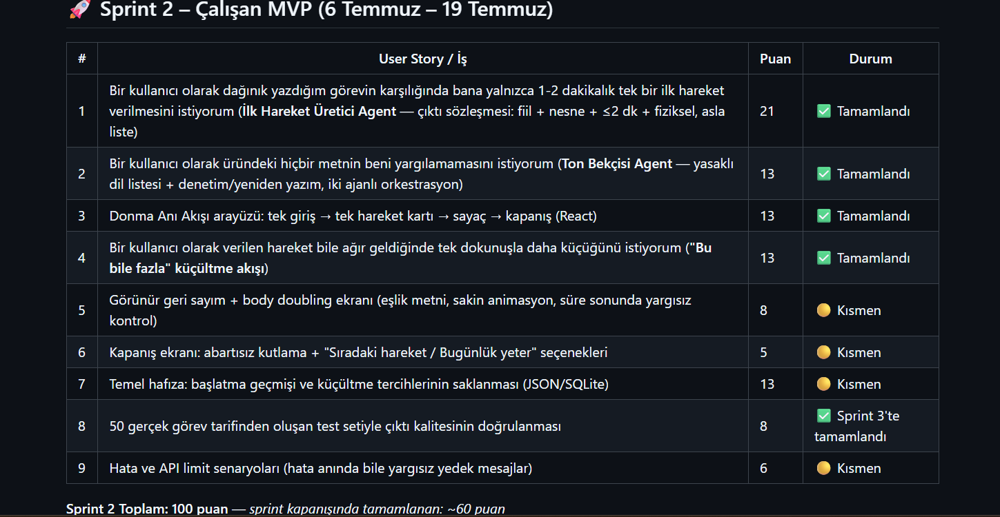

#### Ürün Durumu
Donma anı akışı uçtan uca çalışır durumdadır: görev girişi → tek mikro hareket kartı ("Başlıyorum" / "Bu bile fazla") → body doubling'li geri sayım → yargısız kapanış. Backend gerçek Gemini API'siyle tek hareket üretir, Ton Bekçisi yargı dilini engeller, oturumlar hafızaya kaydedilir.

**Giriş — tek soru, tek kutu:**
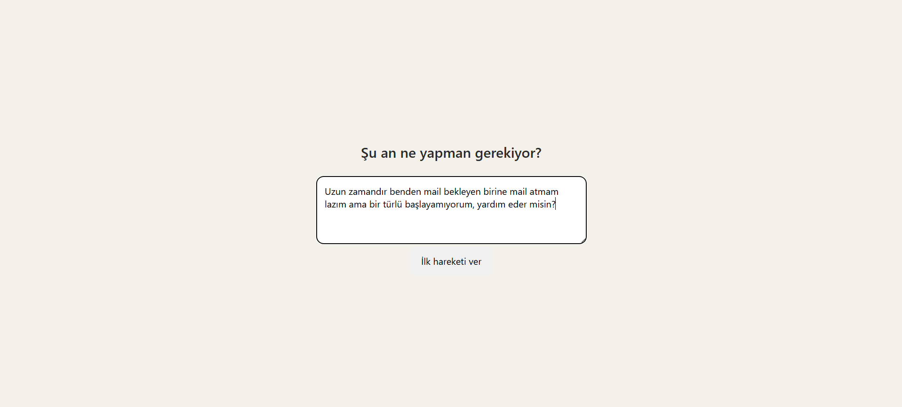

**İlk Hareket Kartı — tek mikro hareket + yargısız bağlam + iki düğme:**
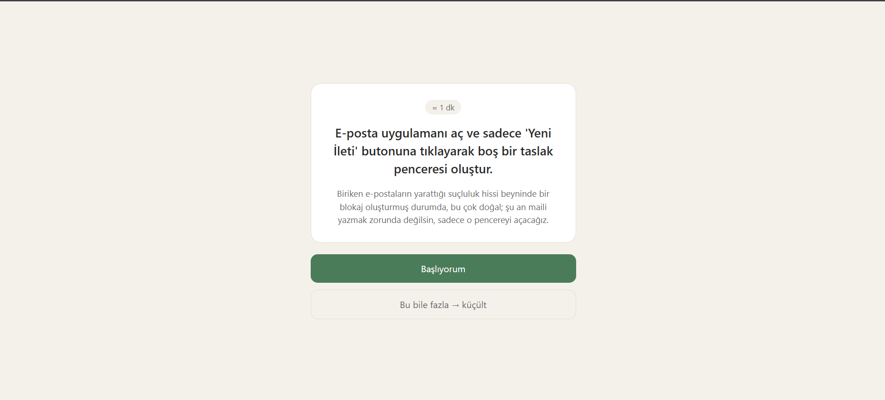

**"Bu bile fazla" — daha küçük, daha fiziksel bir hareket:**
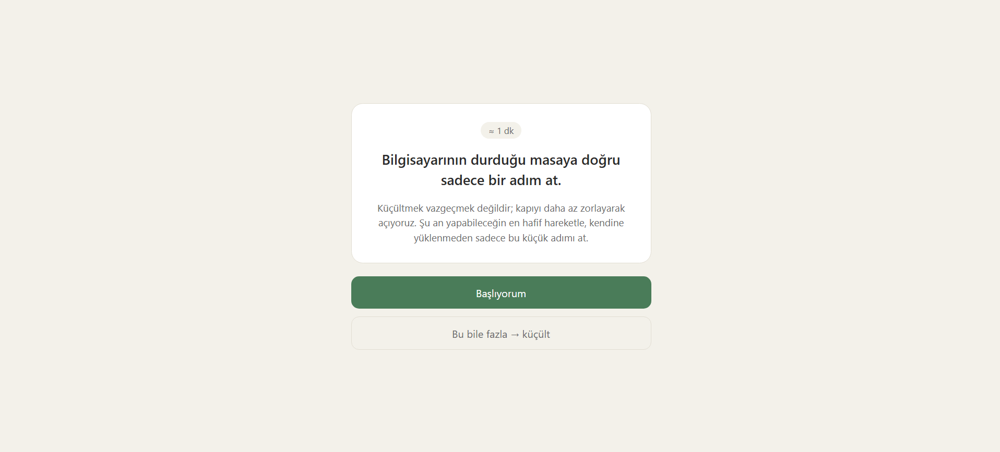

**Sayaç + body doubling — sakin geri sayım ve eşlik:**
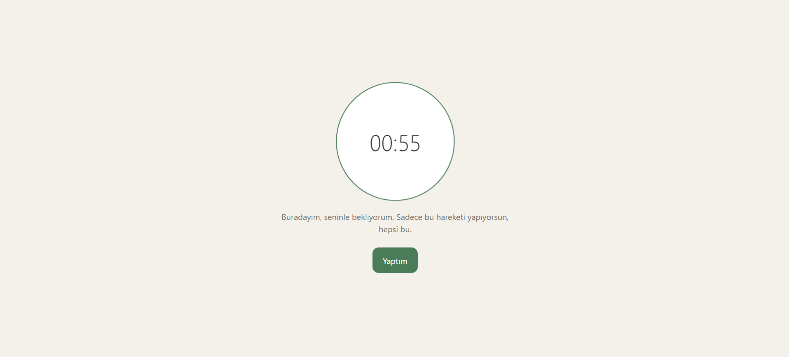

**Kapanış — abartısız kutlama, zorlamasız seçenekler:**
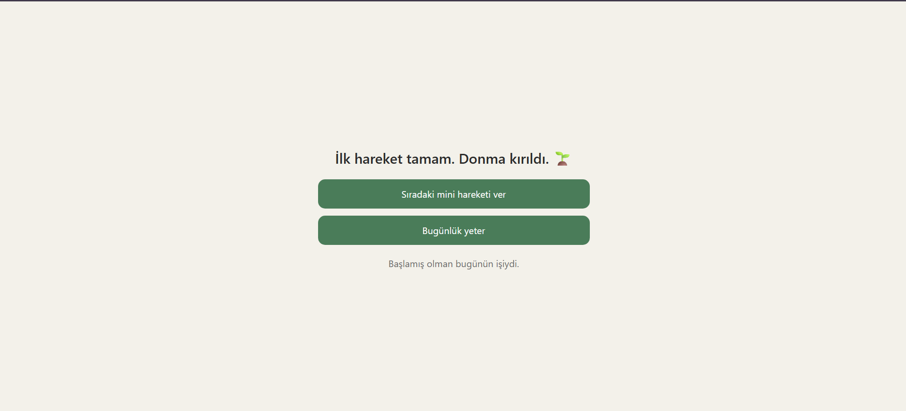

#### Teknoloji Notu
Backend başta FastAPI + uvicorn planlandı; ancak geliştirme makinesindeki Python 3.13.13 bu yığınla native çökme (access violation) verdiği için backend, hiçbir dış paket gerektirmeyen Python standart kütüphanesi `http.server` + Gemini REST mimarisine taşındı. **API sözleşmesi (uçlar + JSON) değişmedi**, frontend etkilenmedi. Ayrıntı: [Sprint2 planı §3](docs/sprint2/Sprint2_Gorev_Plani.md).

#### Sprint Review
* Sprint hedefinin çekirdeği (çalışan MVP) karşılandı ve demo edilebilir durumda: iki ajanlı orkestrasyon, donma anı akışının dört ekranı, küçültme, hafıza ve yargısız hata yedekleri.
* Karşılaşılan teknik engel (Python 3.13.13 / FastAPI-uvicorn native uyumsuzluğu) çözüldü; backend stdlib tabanlı bir mimariye taşınarak her makinede çalışır hale getirildi.
* Kod, dokümantasyon ve kurulum dosyaları GitHub'a yüklendi.
* Planlanan görev dağılımının bir kısmı (arayüz cilası, test seti genişletme, süreç çıktıları) ekip katılımı sağlanamadığı için Sprint 3'e taşındı.

#### Sprint Retrospective
* **İyi gidenler:** Sprintin en zor kısmı — çalışan, demo edilebilir bir MVP çekirdeği — ortaya çıktı. Beklenmeyen bir teknik engel sprint içinde çözüldü.
* **Zorluklar:** Ekip koordinasyonu sağlanamadı. Görev planı paylaşıldı ancak ekip üyelerinden dönüş/commit gelmedi; iş yükü tek kişide kaldı ve planlanan işlerin bir kısmı yetişmedi.
* **Alınan kararlar (Sprint 3):** (1) Görev dağılımı ve beklentiler ekiple yeniden, net şekilde konuşulacak; küçük ve takip edilebilir hedeflere bölünecek. (2) Düzenli (kısa ve yazılı) check-in'ler konarak ilerleme görünür kılınacak. (3) Ekip katılımı yine sağlanamazsa kapsam, tek kişinin gerçekçi biçimde bitirebileceği bir MVP'ye daraltılacak — böylece teslim riske girmeyecek.

</details>

<details>
<summary><h4>🏃‍♂️ Sprint 3 (20 Temmuz – 2 Ağustos 2026)</h4></summary>

#### Sprint Notları

Sprint 3'ün hedefi **Kişiselleştirme ve Teslim** olarak belirlendi: ürünün, kullanıcının kendi beyan ettiği profile göre hem hareketin boyutunu hem konuşma tonunu uyarlaması ve bootcamp teslim çıktılarının tamamlanması. Sprint içinde kalan süreye göre yeniden sıralanmış yürütme planı hazırlandı: [docs/sprint3/Revize_Plan.md](docs/sprint3/Revize_Plan.md)

Sprint boyunca **iki kapsam kararı** alındı ve gerekçeleriyle belgelendi:

* **#5 — Canlıya alma → canlıya alınabilirlik hazırlığı (13 → 5 puan).** Kılavuz canlı linki opsiyonel tutmakta (s.24), ekstra puan kriteri ise *"canlıya alınmış **veya** canlıya alınabilecek şekilde geliştirilme yapılmış"* şeklinde tanımlanmaktadır (s.25). Kalan sürede ilk kez deploy denemek yerine, proje deploy edilebilir hale getirilip talimatı belgelendi: [DEPLOY.md](DEPLOY.md). Bu hazırlık sırasında gerçek bir engel bulundu ve giderildi (aşağıda).
* **#10 — Fiyatlandırma sayfası (mock) kapsam dışı (3 puan).** Ürün bir donma anı aracıdır; arayüzde fiyat/satış öğesi bulunması "ekran başına en fazla bir karar" ilkesiyle çelişir. İş modeli belgesiz kalmamaktadır — freemium yapısı, premium fiyatlandırma ve B2B/EAP kanalı [docs/UrunStratejisi.md](docs/UrunStratejisi.md) §4'te ayrıntısıyla yazılıdır.

Ayrıca Sprint 2'den devreden borçlar bu sprintte kapatıldı: test seti 50 göreve tamamlandı ve Sprint 2 sprint board görseli eklendi.

#### Tamamlanan Puan ve Mantığı

* **Sprint 3 planlanan:** 100 puan → **kapsam revizyonu sonrası hedef: 89 puan** · **Tamamlanan: […]**
* Backlog'daki #1, #2 ve #3 ayrı işler olarak planlanmış olsa da **aynı veri hattını (kullanıcı profili) paylaştıkları için tek gövde halinde geliştirildi**; bu, 42 puanlık işin tek ve tutarlı bir mimari üzerinden çıkmasını sağladı.

| # | İş | Puan | Durum |
|---|----|------|-------|
| 1 | Akıllı Hafıza ile kişiselleştirme | 21 | ✅ Tamamlandı |
| 2 | Tanışma Sohbeti (3 soruluk onboarding + profil kaydı) | 13 | ✅ Tamamlandı |
| 3 | Ton profili — Ton Bekçisi'nin uyarlanması | 8 | ✅ Tamamlandı |
| 4 | Deneyim iyileştirmeleri ve bilişsel yük denetimi | 8 | ✅ Tamamlandı |
| 5 | Canlıya alınabilirlik hazırlığı *(revize)* | 5 | ✅ Tamamlandı |
| 6 | Uçtan uca test ve hata düzeltmeleri | 8 | ✅ Tamamlandı |
| 7 | 3 dakikalık tanıtım videosu | 13 | […] |
| 8 | Final dokümantasyon | 8 | ✅ Tamamlandı |
| 9 | Ürün Teslim Formu ve son kontroller | 5 | […] |
| — | *Sprint 2 borcu:* test seti 10 → 50 + koşum raporu | (8) | ✅ Tamamlandı |

#### Daily Scrum

Sprint 3 daily scrum notları: 📄 [docs/sprint3/daily_scrum.md](docs/sprint3/daily_scrum.md)

#### Sprint Board

Sprint board, backlog dosyası üzerindeki durum kolonlarıyla takip edilmiştir: [docs/ProductBacklog.md](docs/ProductBacklog.md)

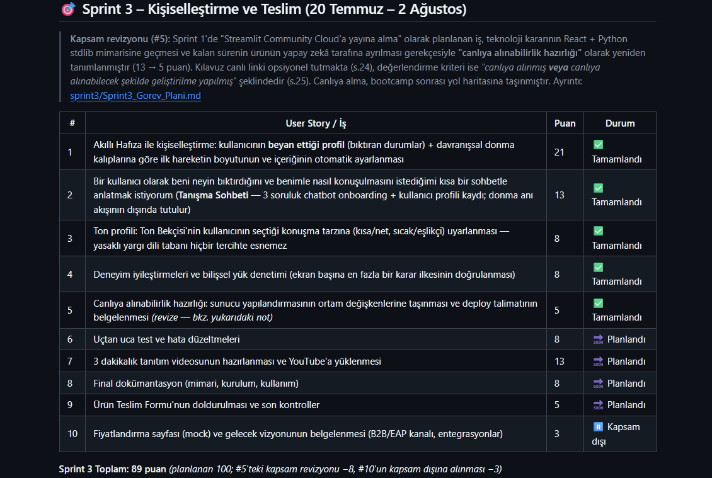

#### Ürün Durumu

Sprint 3 sonunda ürün, donma anı akışına ek olarak **kullanıcıyı tanıyan** bir yapıya kavuştu. Akışın dışında yürütülen kısa bir Tanışma Sohbeti ile kullanıcı, kendisini bıktıran alanları, kendisiyle nasıl konuşulmasını istediğini ve gün içinde en çok ne zaman zorlandığını beyan eder. Bu profil **her iki ajanı da** besler.

**Kişiselleştirme nasıl çalışıyor:** İlk hareketin başlangıç boyutunu üç sinyal birlikte belirler — beyan edilen zorlayıcı alanlar, geçmiş oturumlardaki küçültme davranışı ve uygulamanın beyan edilen "zor saatte" açılmış olması. Her sinyal hareketi bir kademe küçültür.

Ölçülmüş sonuç — aynı görev (*"vergi beyannamemi yazmam lazım ama üç gündür bakamıyorum"*), dört kademede:

| Kademe | Etkin sinyal | Üretilen ilk hareket |
|---|---|---|
| 0 | yok | *"Vergi klasörüne çift tıkla ve aç."* |
| 1 | bir sinyal | *"Bilgisayarın güç tuşuna bas, masaüstünün açılmasını bekle."* |
| 2 | iki sinyal | *"Bilgisayarının bulunduğu masaya yürü ve ekranına bak."* |
| 3 | üç sinyal | *"Sadece bilgisayarın bulunduğu masaya doğru bir adım at."* |

Kademe arttıkça hareket görevden **uzaklaşır**: işin bir parçasını yapmak → yalnızca hazırlık → nesneye dokunmadan mekâna gitmek → görevle hiç temas etmeyen tek bedensel jest.

Etkinin büyüklüğü göreve bağlıdır ve bu bilinçli olarak ölçülmüştür: taban hareketin küçülecek alanı olan görevlerde (bürokrasi, iş/okul) fark kademe 1'den itibaren belirginken, taban çıktısı zaten asgari olan basit fiziksel görevlerde (bulaşık, çöp) fark kademe 2'den sonra ortaya çıkar.

**Ton profili** yalnızca üslubu değiştirir; yasaklı yargı dili listesi hiçbir tercihte esnemez. Aynı görev, iki farklı tonda:

* `kısa ve net` → *"Donma hissi, zihnin aşırı yüklenmeye verdiği doğal bir tepkidir."* (9 kelime)
* `sıcak ve eşlikçi` → *"…beynin donakalması çok doğaldır; şu an amacımız tamamlamak değil, seninle yan yana sadece ilk adımı atmak."* (22 kelime)

**Tanışma Sohbeti 1/3 — bıktıran alanlar.** Çoklu seçim + serbest metin. Her adımda "Şimdi değil" bağlantısı vardır; kullanıcı hiçbir soruyu cevaplamaya zorlanmaz:
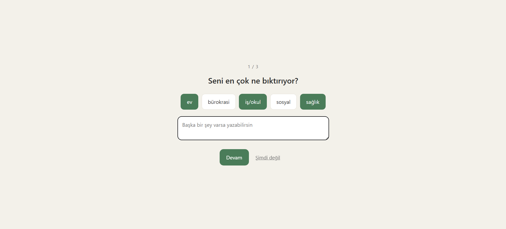

**2/3 — ton tercihi.** Seçilen üslup her iki ajanın metinlerine yansır; yasaklı yargı dili sınırı hiçbir tercihte esnemez:
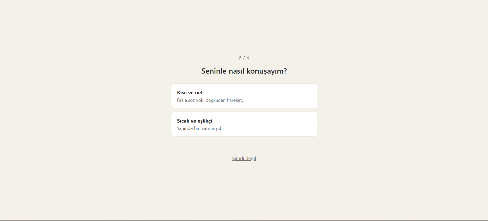

**3/3 — zorlanılan zaman dilimi.** Uygulama beyan edilen dilimde açılırsa hareket bir kademe daha küçük başlar:
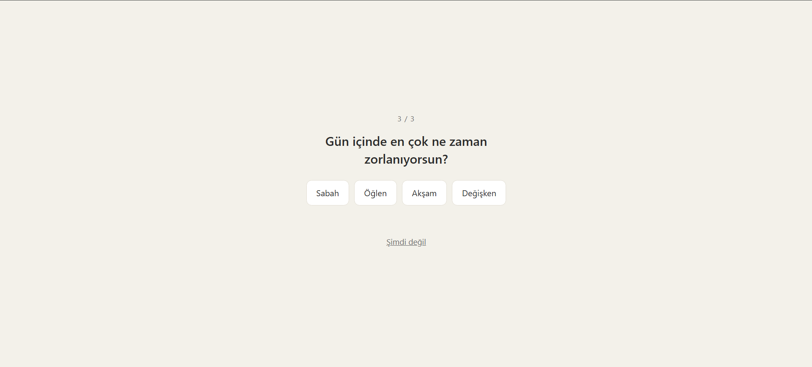

**İlk hareket kartı.** *"Bulaşıkları yıkamam lazım ama kalkamıyorum"* girdisine üretilen kart: tek hareket, süre rozeti, yargısız bağlam ve yalnızca iki düğme. Kartın altındaki "Bu bile fazla → küçült" ürünün kalbidir — hayır demenin utançsız yolu:
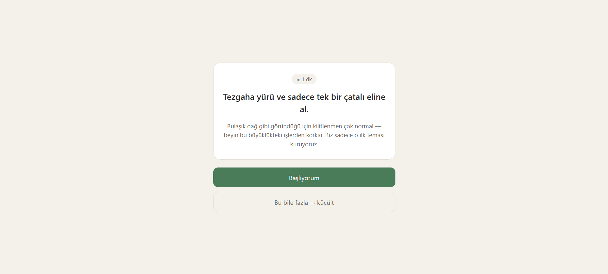

**Süre sonu kontrolü.** Sayaç bittiğinde ürün *"süren doldu!"* demez; yargısız bir soruyla açılır ve karar kullanıcıya bırakılır. Yapmamak da bir seçenektir:
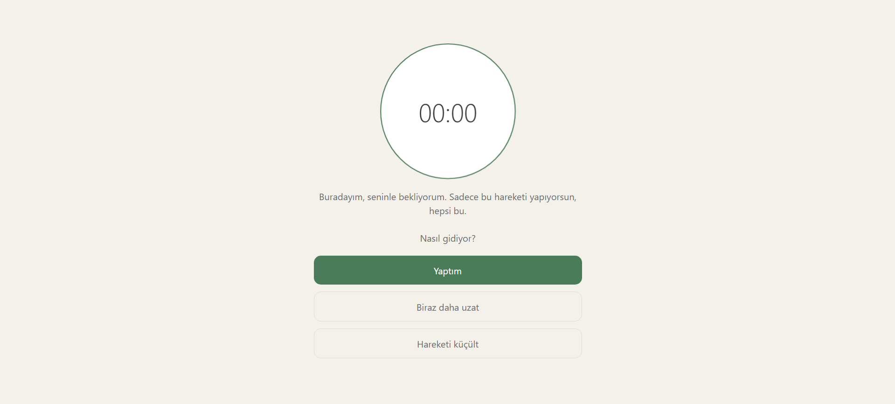

🎬 **3 dakikalık tanıtım videosu:** […]

#### Kalite Doğrulaması

* **Çıktı kalitesi regresyon testi:** 50 görevlik test seti (5 kategoride 10'ar tarif) İlk Hareket Üretici'den geçirildi; her çıktı hem çıktı sözleşmesine hem Ton Bekçisi'ne göre denetlendi. **Sonuç: 50/50 çıktı sözleşmeye uydu**, başarısız görev yok — rapor: [docs/sprint3/test_raporu.md](docs/sprint3/test_raporu.md)
* **Bilişsel yük denetimi:** Beş ekranın tamamı "ekran başına en fazla bir karar" ölçütüyle tek tek geçildi; sonuç, gerekçelendirilen tek istisnayla birlikte belgelendi: [docs/sprint3/bilissel_yuk_denetimi.md](docs/sprint3/bilissel_yuk_denetimi.md)
* **Uçtan uca test:** Tanışma Sohbeti'nden kapanış ekranına kadar tüm akış, atlama ve küçültme yolları dahil sınandı; mobil düzen 375 px'te ölçüldü. Test sırasında **üç kullanıcı arayüzü sorunu bulundu ve giderildi**: [docs/sprint3/uctan_uca_test.md](docs/sprint3/uctan_uca_test.md)

#### Sprint Review

* Sprint hedefinin ürün tarafı tamamlandı: kişiselleştirme gövdesi, Tanışma Sohbeti ve ton profili devreye alındı. İki ajanlı orkestrasyon artık kullanıcı profiliyle besleniyor.
* Kişiselleştirme **süs veri üretmiyor:** Tanışma Sohbeti'nde sorulan üç sorunun üçünün de kodda karşılığı vardır (hareketin boyutu, Ton Bekçisi'nin üslubu, saate bağlı ek küçültme). Karşılığı olmayan bilgi kullanıcıdan istenmemiştir.
* Canlıya alma bilinçli olarak kapsam dışında bırakıldı; ürün deploy edilebilir halde bırakıldı ve talimatı, bilinen sınırlarıyla birlikte belgelendi.
* **Denetimler iki gerçek hata ortaya çıkardı ve ikisi de giderildi:** (1) sayaç ekranında süre uzatıldığında "süre doldu" kontrolü ekranda takılı kalıyordu; (2) test koşucusu Windows konsolunun Türkçe kod sayfasında `UnicodeEncodeError` ile çöküyordu — bu, test setinin daha önce koşulamamış olmasını da açıklamaktadır.
* Sprint 2'den devreden borçlar kapatıldı: test seti 50 göreve tamamlandı, Sprint 2 sprint board görseli eklendi.
* Ekip içindeki iş bölümü bu sprintte de eşit dağılmadı; geliştirme Product Owner'da yoğunlaştı. Buğra ürün kararlarına ve önceliklendirmeye fikir vererek, Yeliz ise tanıtım videosunun hazırlanmasını üstlenerek katkı verdi. Ancak ekip içi iletişimdeki aksama önceki sprintlerde görülen gecikmeyi tekrarladı: sprintin ilk on bir günü commit'siz geçti ve geliştirme son iki güne yığıldı. Kapsam bu gerçeğe göre iki kez daraltıldı (#5 canlıya alma, #10 fiyatlandırma); her iki karar gerekçesiyle birlikte backlog'a ve yürütme planına işlendi. Sprint hedefinin ürün tarafı buna rağmen tamamlandı.

#### Sprint Retrospective

* **İyi gidenler:** Backlog'da ayrı görünen üç işin aynı veri hattını paylaştığı fark edildi ve tek gövde halinde geliştirilerek zaman kazanıldı. Kapsam kararları erken alınıp gerekçeleriyle belgelendi; bu, teslim baskısı altında ne feda edileceğinin tartışılmasını önledi.
* **Zorluklar:** Ekip içi iletişimdeki aksama, önceki sprintlerde de yaşanan gecikmeyi yeniden getirdi — sprintin ilk on bir günü commit'siz geçti ve geliştirme son iki güne yığıldı. Sprint 2 retrospektifinde alınan "düzenli ve yazılı check-in" kararı bu sprintte de tam olarak hayata geçirilemedi.

  Teknik tarafta üç engelle karşılaşıldı ve üçü de sprint içinde çözüldü: test koşucusu Windows konsolunun Türkçe kod sayfasında çöküyor ve test setinin koşulmasını engelliyordu; kullanılan modelin ücretsiz katmandaki günlük limiti (20 istek) hem regresyon testini hem normal kullanımı imkânsız kılıyordu; Türkçe'nin eklemeli yapısı, geçmiş görevlerin kelime tabanlı eşleştirilmesini boşa çıkarıyordu.

  **En öğretici bulgu doğrulamanın zamanlamasıyla ilgilidir.** Kişiselleştirmenin ilk ölçümde beklenen boyut farkını üretmediği, küçültme akışının aynı bağlam cümlesini tekrarladığı ve sayaç ekranının süre uzatıldığında takıldığı ancak sprintin sonunda, ürün gerçekten kullanıldığında ortaya çıktı. Bu sorunların hiçbiri kod okunarak değil, ürün denenerek bulundu; doğrulama sprintin sonuna bırakılmamalıydı.
* **Bootcamp sonrası yol haritası:** Canlıya alma (Render + Vercel — hazırlığı tamamlandı), hafızanın kalıcı bir veri katmanına taşınması, çok kullanıcılı kullanım için oturum katmanı, test setinin gerçek kullanıcı verisiyle genişletilmesi.

</details>
